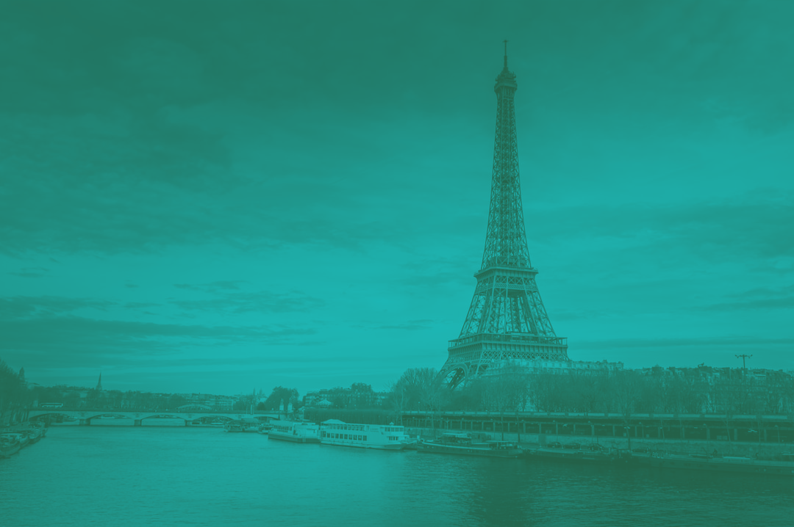

# Devoxx France 2023 templates

This content is in English. Feel free to contact the Devoxx team by email if needed. 

L'ensemble de la documentation est en Anglais afin de ne pas devoir maintenir 2 versions. Nous vous remercions pour votre compréhension.

# README #

This is an open repository for Devoxx France template.

### What is this repository for? ###

This repository contains various templates for Devoxx France. It's not a closed repository, you can also contribute and propose your presentation.
Each year, the master branch contains the latest version, for the next conference.

If your presentation is in French, make sure to use French on your slides.

### What is include? ####

We offer the following supports : 
- Keynote v11 for Mac
- Powerpoint

### How do I contribute? ###

If you want to create your own Devoxx France Theme, we'd like that you use our guidelines, fonts and logo so that we can offer a consolidated experience to our attendees.

If you want to publish your work : 

  - add your name to the contributors.txt file
  - create a pull request 
  - submit your PR and send an email to nicolas.martignole AT devoxx.fr 

### Devoxx France 2023 Fonts and Colors

### Fonts

For main text we use [Open Sans](https://fonts.google.com/specimen/Open+Sans), one of the Google Font, with variant Normal, 400
We also use [Calibri](https://www.microsoft.com/en-us/download/details.aspx?id=10725) for some titles.

### Thematic fonts

New for 2023 : we designed a different theme for each Devoxx France track. Feel free to use this theme.
It is not mandatory. 

The extra fonts to use are all available under the [Fonts](https://github.com/quantixx/template-presentation/tree/master/Fonts) folder or can also be downladed from Google Fonts:

 - Abril Fatface : https://bit.ly/3j90tm2
 - Berkshire Swash : https://bit.ly/3kLEke4
 - Big Shoulders Inline Display : https://bit.ly/40aX0nV
 - Stick : https://bit.ly/3R8Xu9X
 - Trochut : https://bit.ly/3WNEHlE
 - Caesar Dressing : https://bit.ly/3je4s0L
 - Bungee Hairline : https://bit.ly/40bYWMH

(click on the Download family link for Google Fonts)


### Images 

Check the [Images]()

#### Color chart

All colors are documented inside the templates.

Main title color
#E2A86E

Main Highlight color
#F88224

Default text color
#FFFFFF

ALT TEXT
#E9E2DB

ALT GREY
#E9E2B

### Images

You can generate [Dualtone photos](https://duotone.shapefactory.co/?i=ELy8RcnCgEo&f=313741&t=6bb884&q=wave)  
using the colors from the theme



### What is the Devoxx France 2023 Theme?  

The main background image was generated by Nicolas Martignole using DALL-E during Devoxx Belgium 2022. The prompt 
that was used is the following : 

```The year is 2050, we see a view of Paris with modern public transportation, a steam-punk ballon and 2 drones,  as a Jules Vernes poster```


### What is the recommended format for the templates? 

Almost all presentations are recorded during Devoxx France. Your presentation will be available few weeks after Devoxx France on the [Youtube Devoxx channel](https://www.youtube.com/channel/UCsVPQfo5RZErDL41LoWvk0A) 

We recommend that you keep the 16/9 ratio format for optimal display.
Devoxx France are not mandatory. If you prefer to use your own presentation, do it.
However please insert a first slide with the Devoxx France theme, then keep your presentation as it is. Always remember : your presentation is recorded. 

Last but not least, we also have a code of conduct on the Devoxx France web site.

Thanks

Nicolas Martignole
nicolas.martignole@devoxx.fr


