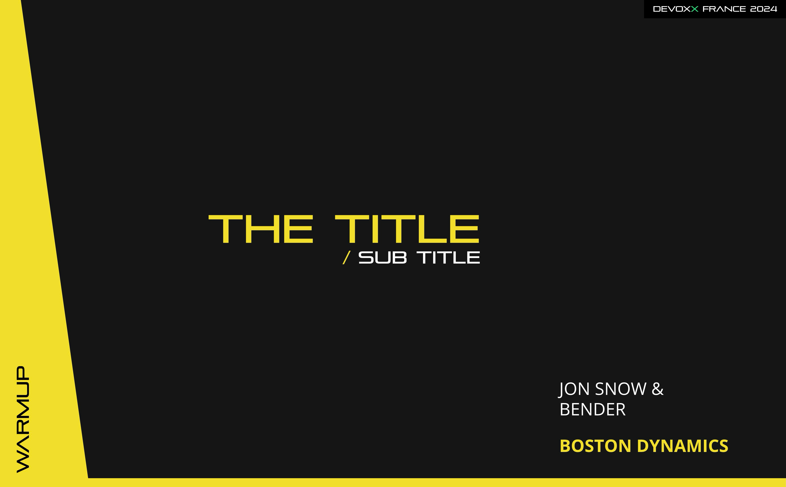
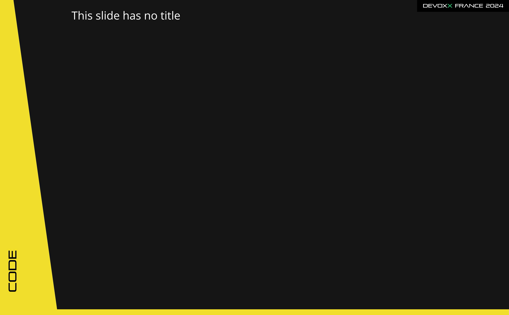

# Templates for SliDesk

This is a template for [SliDesk](https://github.com/slidesk/slidesk) presentation.

In this folder you can find the `main.sdf` file to start your presentation with differents templates.

## Main


```
## .[main-slide]

# Title Devoxx 2024
```

## Title Slide



```
## The Title .[title-slide]

<p class="subtitle">Sub Title</p>

<div class="content">

JON SNOW &<br />
BENDER

**BOSTON DYNAMICS**

</div>

<div class="left-text"><p>Warmup</p></div>
```

The `left-text` is the text that will be displayed on the left side of the slide.

The `content` is the text that will be displayed on the right side of the slide.

## No Title



```
## .[no-title-slide]

<div class="left-text"><p>Code</p></div>

<div class="content">

This slide has no title

</div>
```

## Thanks


```
## Thanks .[thanks-slide]
```
