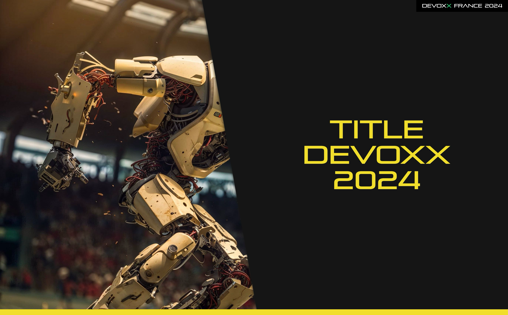

# Templates for SliDesk

This is a template for [SliDesk](https://github.com/slidesk/slidesk) presentation.

In this folder you can find the `main.sdf` file to start your presentation with differents templates.

To change the color of your presentation, you can edit the `devoxx2k24/theme.css` file.

```css
/* change with your devoxx theme color */
--sd-primary-color: var(--color-java);
```

With the css variables available:

```css
--color-build-deploy: #0de07d;
--color-java: #f3de2c;
--color-architecture: #f88224;
--color-data-ai: #df57bc;
--color-server-size: #3083dc;
--color-security: #4e4187;
--color-people-culture: #8877d4;
--color-mind-geek: #3083dc;
--color-ux-ui: #c1b367;
--color-dev-language: #2fb496;
```

## Main



```
## .[main-slide]

# Title Devoxx 2024
```

## Title Slide


```
## The Title .[title-slide]

<p class="subtitle">Sub Title</p>

<div class="content">

JON SNOW &<br />
BENDER

**BOSTON DYNAMICS**

</div>

<div class="left-text"><p>Warmup</p></div>
```

The `left-text` is the text that will be displayed on the left side of the slide.

The `content` is the text that will be displayed on the right side of the slide.

## No Title


```
## .[no-title-slide]

<div class="left-text"><p>Code</p></div>

<div class="content">

This slide has no title

</div>
```

## Thanks


```
## Thanks .[thanks-slide]
```
