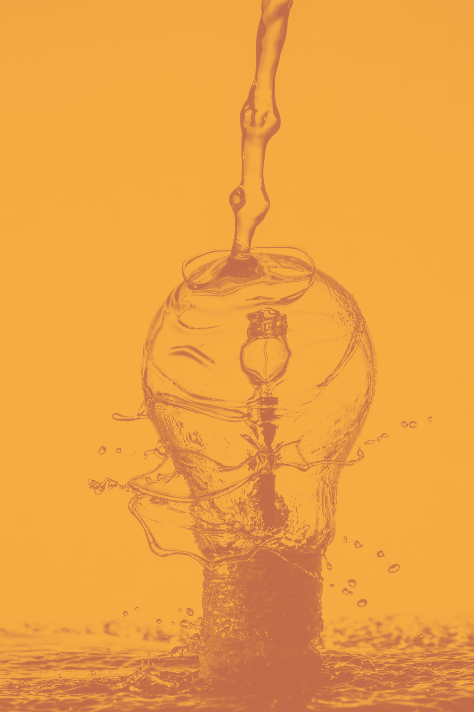

title: Devoxx France 2019
class: animation-fade
layout: true

<!-- This slide will serve as the base layout for all your slides -->
.bottom-bar[
  \#DevoxxFR
]

---

class: impact

# {{title}}
## Sample presentation

---

# We love picture


We try to keep the Devoxx France logo and the Tweet hashtag on all slides

---

# Roadmap

This is a slide without background images.

You must load and install 2 Fonts on your system :

- Montserrat (https://www.fontsquirrel.com/fonts/montserrat)
- Open Sans (https://www.fontsquirrel.com/fonts/open-sans)

---

# Devoxx FR 2019 colors

See online on [Adobe color](https://color.adobe.com/fr/Mon-th%C3%A8me-Color-color-theme-12221805/?)

---

### Show me some code !

`Try to keep a font size as big as possible. Remember also that too much code on one slide is useless. The audience reads this texte and does not listen to your presentation anymore. Try to split on different slides your presentation.`

---

### Step 1 : add to Redis sorted set

```bash
127.0.0.1:6363[2]> zadd hackers 1953 "Richard Stallman"
(integer) 1
127.0.0.1:6363[2]> 
127.0.0.1:6363[2]> zadd hackers 1969 "Linus"
(integer) 1
127.0.0.1:6363[2]> zadd hackers 1912 "Alan turing" 
(integer) 1
```

---

### Step 2 : Show the list of Hackers

```nohighlight
127.0.0.1:6363[2]> zadd hackers 1953 "Richard Stallman"
(integer) 1
127.0.0.1:6363[2]> 
127.0.0.1:6363[2]> zadd hackers 1969 "Linus"
(integer) 1
127.0.0.1:6363[2]> zadd hackers 1912 "Alan turing" 
(integer) 1
```
```bash
127.0.0.1:6363[2]> zrange hackers 0 -1
1) "Alan turing"
2) "Richard Stallman"
3) "Linus"
```

---

### Step 3 : Show the list with score

```nohighlight
127.0.0.1:6363[2]> zadd hackers 1953 "Richard Stallman"
(integer) 1
127.0.0.1:6363[2]> 
127.0.0.1:6363[2]> zadd hackers 1969 "Linus"
(integer) 1
127.0.0.1:6363[2]> zadd hackers 1912 "Alan turing" 
(integer) 1
```
```nohighlight
127.0.0.1:6363[2]> zrange hackers 0 -1
1) "Alan turing"
2) "Richard Stallman"
3) "Linus"
```
```bash
127.0.0.1:6363[2]> zrange hackers 0 -1 withscores
1) "Alan turing"
2) "1912"
3) "Richard Stallman"
4) "1953"
5) "Linus"
6) "1969"
```

---

class: impact

# Merci / Thank you

---

.col-6[
## Facts

Devoxx France 2019

241 speakers with a bagde, 68 exhibitors

and more than 3000 attendees
]
.col-6[

]

---

class: impact

# Less code is less bug

---

# Why less slides is better than more slides

- Devoxx France runs on 3 days
- Audience loves live coding and demo
- Too much bullet points is super boring
- More text : less concentration from the audience that will just read your slides
- So this is exactly what you should not do

---

# Pourquoi peu de diapositives c’est mieux

- Devoxx France se déroule sur 3 jours
- Le public préfère les démonstrations et l’écriture de code en direct
- Trop de points avec des puces c’est ennuyant
- Si vos slides peuvent vous remplacer, alors vous ne servez à rien comme orateur
- Imaginez que votre ensemble de diapos ne doivent pas pouvoir vivre sans vous, sans votre présentation et votre contenu
- Merci donc de ne PAS faire comme ce slide à mourir

---

# Toujours plus d'image

Les diagrammes dynamiques c’est vraiment top


---


.center[
[https://cfp.devoxx.fr](https://cfp.devoxx.fr)
]

---

- Here are just a few photos from Devoxx France so that you get a better idea of what you’re about to live
- Voici quelques photos de Devoxx France afin de vous donner une idée de ce que vous vous apprêtez à vivre...

---

class: full, middle, center
background-image: url(./images/slide_22.jpg)

---

class: full, middle, center
background-image: url(./images/slide_23.jpg)

---

class: full, middle, center
background-image: url(./images/slide_24.jpg)

---

class: full, middle, center
background-image: url(./images/slide_25.jpg)

---

# Thanks

Contribute and propose other templates on [https://github.com/quantixx/template-presentation](https://github.com/quantixx/template-presentation)

---

# The basics

## Getting started

Use [Markdown](https://github.com/adam-p/markdown-here/wiki/Markdown-Cheatsheet) to write your slides. Don't be afraid, it's really easy!

--

## Making points

Look how you can make *some* points:
--

- Create slides with your **favorite text editor**
--

- Focus on your **content**, not the tool
--

- You can finally be **productive**!

---

# There's more

## Syntax highlighting

You can also add `code` to your slides:
```html
<div class="impact">Some HTML code</div>
```

## CSS classes

You can use .alt[shortcut] syntax to apply .big[some style!]

...or just <span class="alt">HTML</span> if you prefer.

---

# And more...

## 12-column grid layout

Use to the included **grid layout** classes to split content easily:
.col-6[
  ### Left column

  - I'm on the left
  - It's neat!
]
.col-6[
  ### Right column

  - I'm on the right
  - I love it!
]

## Learn the tricks

See the [wiki](https://github.com/gnab/remark/wiki) to learn more of what you can do with .alt[Remark.js]
